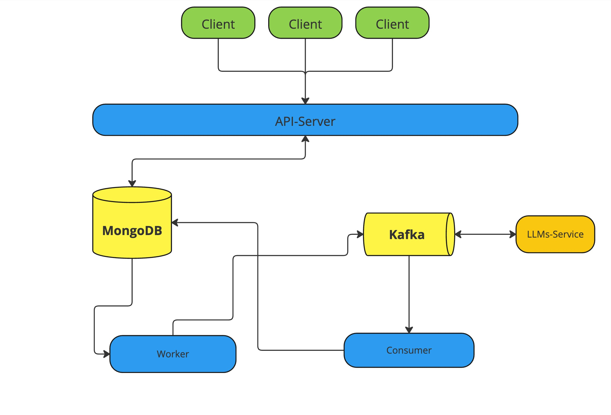

# Common-Backend

Common-Backend contains all server-side logic for service LLM-Tests-Checker.
However, all functionality of tests checking using LLMs is in [LLMs-Service](https://github.com/LLM-Tests-Checker/LLMs-Service).


### Features:

* Code auto-generation based on Open-API definition. Common-Backend API definition contains in [api](./api) folder.
* Using MongoDB as main database of project.
* Using Kafka for messaging between services.
* Configurable environment using [.env](./.env) file.
* Prepared development environment.
* Layered architecture.
* Separation of responsibilities through different applications.

### Project Architecture:

Common-Backend consist of 3 different _GO_ applications:

* Server - provides an external API for service and used for basic CRUD operations.
* Worker - monitors the llm check tasks and sends them to kafka topic.
* Consumer - listens kafka topic with completed llm checks and updates data in the database.

The scheme of the applications work looks like this:



### How to launch?

#### Pre-Requirements:
* Installed GO
* Installed docker and docker-compose

1. Prepare development environment:
```shell
make launch-dev-env
```
2. Launch server:
```shell
make launch-server
```
3. Launch worker:
```shell
make launch-worker
```
4. Launch consumer:
```shell
make launch-consumer
```

### How to contribute?
1. Create new branch from main: `git branch <YOUR_NICKNAME>:<FEATURE_NAME>`
2. Checkout to your branch: `git checkout <BRANCH_NAME_FROM_POINT_1>`
3. Write code
4. Write tests(__IMPORTANT__)
5. Test code on development environment
6. Create Pull Request
7. Wait for approve